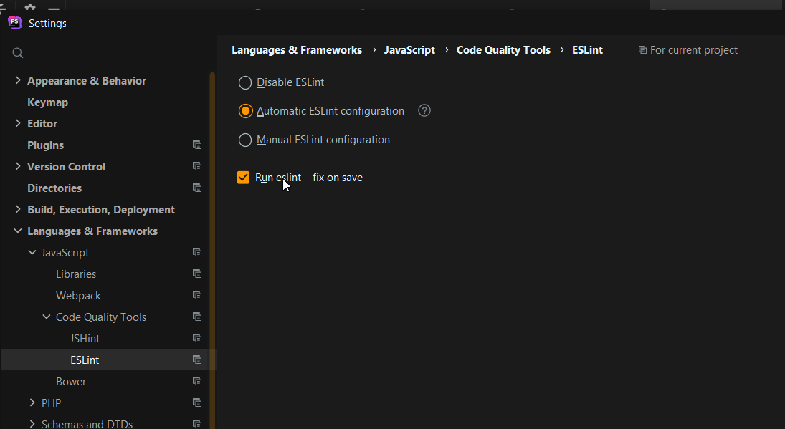

Recently my company ran a campaign on best practices.
One of the main focuses were uniformization of the codebase (naming conventions) and focus on code re-usability.

In my quest to improve the quality of my code I stumbled upon magical tools called linters, 
I already used some before in java projects but never on PHP or VueJS.

Note that most of this tutorial is only useful for people who use PHP (cakePHP or other) and vueJs with Jetbrain's PHPStorm.

For php I use :
[PHP code sniffer](https://github.com/Dealerdirect/phpcodesniffer-composer-installer)
Installation (tldr. from the documentation above):
```composer require --dev dealerdirect/phpcodesniffer-composer-installer```

-> this linter shows every error or warnings without doing much more. 
The next command offer the possibility to automatically fix some syntax issues like useless white spaces.
```vendor/bin/phpcs(.bat if on Windows) --colors -p -s --standard=CakePHP /path/to/code/ (src in my case)```

[Link to get more info about the syntax fixer](https://github.com/squizlabs/PHP_CodeSniffer/wiki/Fixing-Errors-Automatically)
```vendor\bin\phpcbf(.bat) src```
-> simple command to fix everything (except adding comments, phpcbf is a magician, not a writter)

PSR-1 and PSR-2
[PSR-1 is a basic syntax coding standard for PHP](https://github.com/php-fig/fig-standards/blob/master/accepted/PSR-1-basic-coding-standard.md)
[PSR-2 offers more advanced syntax coding standard for PHP](https://github.com/php-fig/fig-standards/blob/master/accepted/PSR-2-coding-style-guide.md)

For VueJS I use :
```npm install --save-dev eslint eslint-plugin-vue```
This command allow to run the following command:
```eslint --ext .js,.vue js``` (the last parameter 'js' is the folder you want to run your linter on, this file contains all of my vue files in my project)
Her role is to highlight all the problems in the project.
Plus you can add --fix to fix most of the syntax problems listed ! (it fixed indentation in a bad way in my project, so I wouldn't really recommend it)

A tip on their documentation hint that if you install the following component, a npm script is automatically added, this script is called lint (npm run lint), 
it does exactly the same thing as the command above.

It may be slightly more practical as you don't have to be digging in your projects folders to find your vue files and run the command above on them.
[Infos about the CLI plugin for eslint](https://github.com/vuejs/vue-cli/tree/dev/packages/%40vue/cli-plugin-eslint)

[And more infos about the installation process](https://eslint.vuejs.org/user-guide/#installation)

With the following .eslintrc.js file at the root of the project (I'm using vueJS 2)  
# .eslintrc.js  
```
module.exports = {
    extends: [
        // add more generic rulesets here, such as:
        'eslint:recommended',
        'plugin:vue/essential',
        'plugin:vue/strongly-recommended',
        'plugin:vue/recommended',
    ],
    rules: {
        // override/add rules settings here, such as:
        // 'vue/no-unused-vars': 'error'
    }
}
```

With the setup of the IDE it makes a pretty good combination :
[JetBrain's PHPStorm installation process for eslint](https://www.jetbrains.com/help/idea/eslint.html)  
  
  

