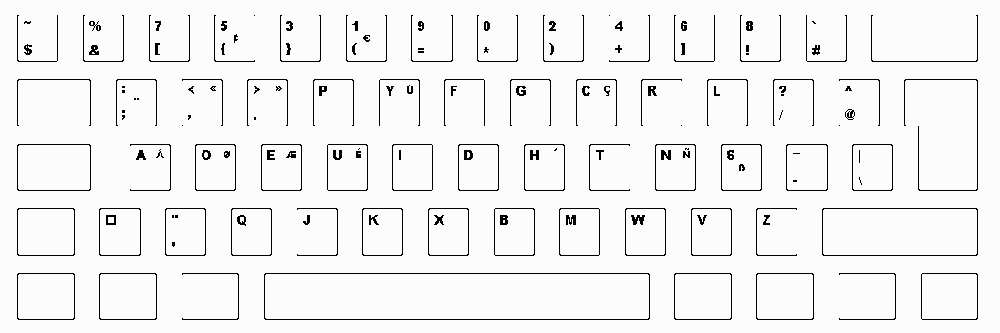

This week I realized that for some time I stagnated at around 65 wpm and can't go much fastest without putting a lot more efforts, 
I still need to gain some muscle memory to rapidly type special characters and uppercase letters 
or I could use a keyboard disposition much more adapted to typing fast and more important, comfortably, 
yes I'm going to brag about why Dvorak is a superior keyboard layout.

The idea of using Dvorak would have never crossed my mind if I wasn't actively searching for ways to improve my typing speed and comfort 
(and in the long term my wrist and fingers health).
The brag start when we think about whether dvorak makes you faster or not, actually I don't really care as much as comfort. 

What made me make the first step is the apparent ease to switch from azerty (french qwerty) to Dvorak, 
it is said to take about 30 to 50 hours to make the full 'muscle memory switch'.
The installation on Windows 10 is trivial and fully integrated (no need for lousy crapwares with taskbars), 
you only have to download a setup program and add the keyboard in the Windows parameters.  
  
Moreover, all my favorite websites to learn touch typing (see About page) propose a Dvorak course !   
  
I also found a very nicely made "diss track" (it's a zine) about why the qwerty/azerty keyboard is inferior and why Dvorak is clearly superior.  
  
[Link to the Dvorak promoter zine](https://www.dvzine.org/)

I'm using myself a variant of dvorak called the programmer dvorak that aims to improve the position of the special characters to (in a programmer perspective) :  
  
  

Where I got all the infos to install the programmer dvorak keyboard layout :  

[Programmer dvorak infos website](https://www.kaufmann.no/roland/dvorak/)

A point that I also find interesting is that my keyboard layout shows azerty so even if I wanted to cheat and watch my keyboard to known where the keys are, 
I can't, forcing me to learn the position of all the keys or dig deep in my memory to remember, 
reinforcing my memory at the same time ! 

